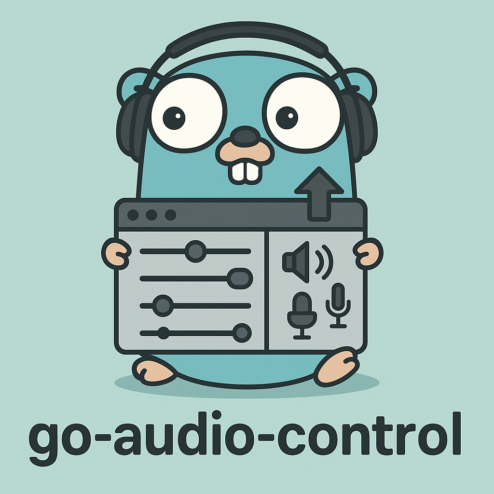

# go-audio-control



Cross-platform audio device management package for Go.

## Features

- Enumerate all audio input/output devices
- Get currently active input/output device
- Set active input/output device
- Monitor for device changes (add/remove/disconnect)
- Works on macOS (CoreAudio) and Windows (WASAPI/MMDevice)

## Potential Applications

- **Audio Switchers** - Quick device switching for headphones, speakers, etc.
- **Meeting Tools** - Auto-manage devices for video conferencing
- **Gaming/Streaming** - Context-based audio device selection
- **Bluetooth Managers** - Handle wireless audio connections
- **Automation** - Switch devices based on time, presence, or running apps
- **Accessibility** - Hearing aid integration and visual indicators

## Installation

```bash
go get github.com/audi70r/go-audio-control
```

## Usage

### List Audio Devices

```go
devices, err := audiocontrol.ListAudioDevices()
if err != nil {
    log.Fatal(err)
}

for _, device := range devices {
    fmt.Printf("%s - Input: %v, Output: %v, Active: %v\n",
        device.Name, device.IsInput, device.IsOutput, device.IsActive)
}
```

### Get/Set Active Output Device

```go
// Get current
device, err := audiocontrol.GetActiveOutputDevice()
if err != nil {
    log.Fatal(err)
}
fmt.Printf("Current output: %s\n", device.Name)

// Set new
err = audiocontrol.SetActiveOutputDevice(deviceID)
if err != nil {
    log.Fatal(err)
}
```

### Monitor Device Changes

```go
audiocontrol.OnDeviceChange(func(event audiocontrol.Event) {
    switch event.Type {
    case audiocontrol.DeviceAdded:
        fmt.Printf("Device added: %s\n", event.DeviceID)
    case audiocontrol.DeviceRemoved:
        fmt.Printf("Device removed: %s\n", event.DeviceID)
    case audiocontrol.ActiveDeviceChanged:
        fmt.Printf("Active device changed to: %s\n", event.DeviceID)
    case audiocontrol.DeviceDisconnected:
        fmt.Printf("Device disconnected: %s\n", event.DeviceID)
    }
})
```

## Platform Notes

### macOS
- Uses CoreAudio framework via CGo
- Requires macOS 10.12 or later
- May require microphone permissions for input device enumeration

### Windows
- Uses Windows Core Audio APIs (WASAPI/MMDevice)
- Requires Windows Vista or later
- Uses COM interfaces via go-ole package

## Examples

See the `examples/` directory for complete working examples.

## License

MIT